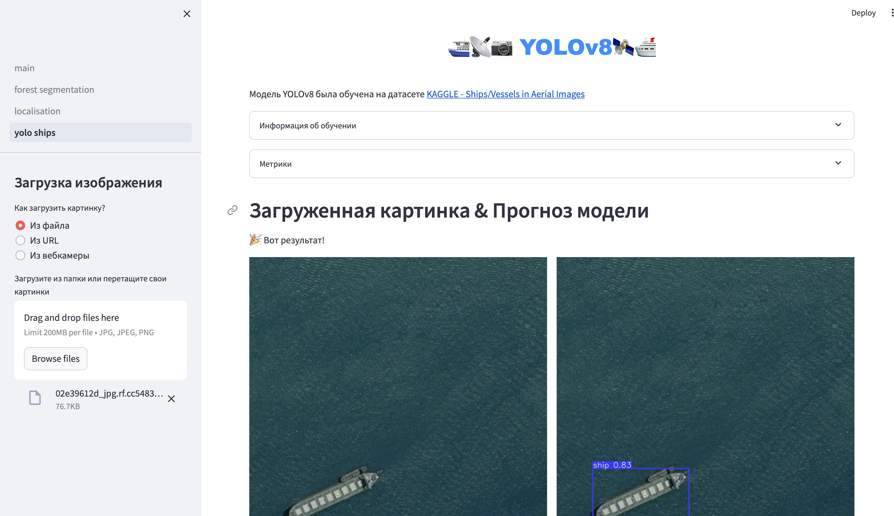

# cv_project

## Описание

Это приложение Streamlit позволяет пользователю загружать изображения различными способами и отображает результаты локализации, детекции и семантической сегментации объектов.

## Интерфейс

## Использование

1. Перейдите по адресу на  [Sreamlit](https://cvproject-ramvursmgqbwxflxvkwprr.streamlit.app/yolo_ships).
2. Выберите модель на боковой панели.
3. Выберите способ загрузки изображения в боковой панели:
   - **Из файла**: загрузите одно или несколько изображений с вашего компьютера.
   - **Из URL**: введите URL изображения.
   - **Из вебкамеры**: сделайте снимок с помощью вебкамеры.
4. Дождитесь загрузки изображения и отображения результата детекции объектов.

## Информация об обучении модели локализации
- Инструмент для локализации объектов на изображении с использованием модели, основанной на архитектуре ResNet-18Модель классифицирует и локализует объекты на изображении, отображая прямоугольные рамки вокруг обнаруженных объектов и соответствующие метки классов.
- 
- **Число классов**: 3 - огурец, баклажан, гриб
- **Объем выборки**: 186 изображений

## Информация об обучении модели YOLOv8
- Обучена на датасете [Ships/Vessels in Aerial Images](https://www.kaggle.com/datasets/siddharthkumarsah/ships-in-aerial-images/data).
- **Число классов**: 1 (корабль)
- **Объем выборки**: 13,435 изображений
- **Метрики**:
  - mAP50: 0.5683,\n  - mAP50-95: 0.30734
  
   
  - График Precision-Recall кривой
  

  - Confusion Matrix
  

## Информация об обучении модели Unet

- Обучен на датасете Kaggle - [Forest Aerial Images for Segmentation](https://www.kaggle.com/datasets/quadeer15sh/augmented-forest-segmentation/data)
- **Объем выборки**: 5 108 изображений
- 
- 
- 
- 

## Команда проекта

- [Левон Мартиросян](https://github.com/kukerg33k?tab=repositories)
- [Сайыына Антонова](https://github.com/SainaAntonova)
- [Игорь Свиланович](https://github.com/svilanovich)

